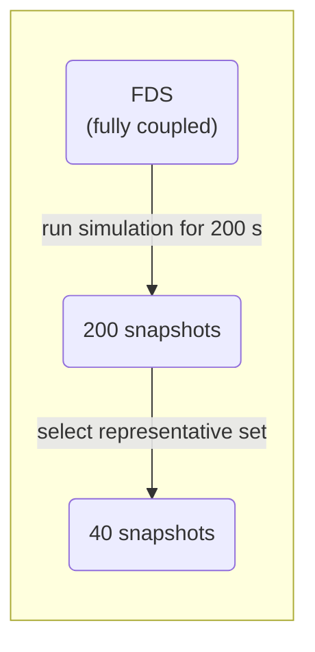
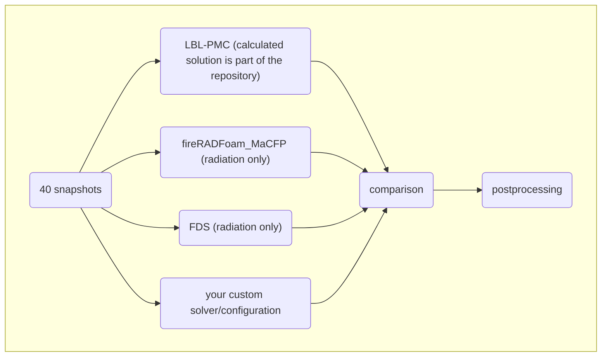

# General Information

General overview about the folder structure is described in the main `README.md` file.

<!-- markdown-toc start - Don't edit this section. Run M-x markdown-toc-refresh-toc -->
**Table of Contents**

- [General Information](#general-information)
    - [Overview](#overview)
    - [Experimental data](#experimental-data)

<!-- markdown-toc end -->

## Overview

The selection is generated by first running a fully coupled FDS simulation with a time step of $\Delta t=0.001$ for $200\,\mathrm{s}$, where all available fields are saved each second, such that one gets a collection of fields each second and $200$ collections overall. One such collection of fields, saved at one distinct time is called a snapshot. 
Because band resolved radiation calculation (with line by line (LBL) photon Monte Carlo (PMC)) is an expensive task, a more or less random selection of $40$ snapshots is taken from the original $200$ ones. The selection is considered to be representative with respect to mean value and extreme events.
The selection process is summarized in the following graph: 

The procedure that is documented in this git is shown in the diagram below.

## Experimental data

The main directory for the FM-Burner is in the `macfp-db` project:
https://github.com/MaCFP/macfp-db/tree/master/Extinction/FM_Burner

There, the experimental setup for the `FM-Burner` is described in detail: 
https://github.com/MaCFP/macfp-db/tree/master/Extinction/FM_Burner/Documentation

And e.g. available experimental data is located at:
https://github.com/MaCFP/macfp-db/tree/master/Extinction/FM_Burner/Experimental_Data

<!-- ## Applied Tools -->
<!-- <XXXX A bit more infoXXX> -->

