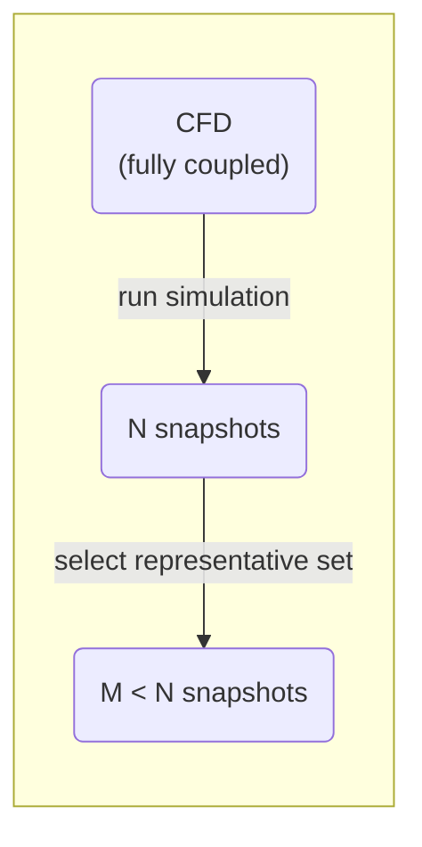
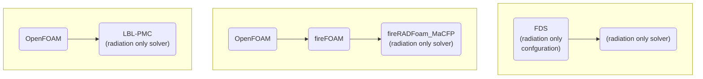

# radi-db

## Measurement and Computation of Radiative Heat Transfer Phenomena Database

**Welcome to the MaCFP database!**

The central objective of the MaCFP working group is to target
fundamental progress in fire science and to advance predictive fire
modeling. The purpose of this database is to host high-quality
experimental and benchmark simulation data for the purpose of validating physics-based fire
experimental and benchmark simulation data for the purpose of validating physics-based fire
models. The working group meets before the IAFSS conference currently
held every three years.

<!-- markdown-toc start - Don't edit this section. Run M-x markdown-toc-refresh-toc -->
**Table of Contents**

- [radi-db](#radi-db)
    - [Measurement and Computation of Radiative Heat Transfer Phenomena Database](#measurement-and-computation-of-radiative-heat-transfer-phenomena-database)
    - [Introduction](#introduction)
    - [Folder Overview](#folder-overview)
    - [Naming Conventions for Fields](#naming-conventions-for-fields)
        - [Field Names](#field-names)
    - [Benchmark Cases](#benchmark-cases)
    - [Methodology](#methodology)
        - [Snapshot Generation and Radiation Benchmark](#snapshot-generation-and-radiation-benchmark)
    - [Solvers](#solvers)
        - [Python](#python)

<!-- markdown-toc end -->

## Introduction

To improve CFD simulations validation with high quality experimental data or "gold standard" simulation data is necessary. The present, flexible data base, that can be extended by community contributions, is designed to serve this need by collecting CFD benchmark cases, where high quality experimental data as well es "gold standard" simulation data are available.

The goal is to provide the data in a form, that is sufficient to reproduce (with proper version of FDS and fireFoam installed) the simulation data. 

The basic structure of a case folder is described in [Folder Overview](#folder-overview), basic filename conventions are described in [File Names](#file-names) and the basic field names are described in the section [Naming Conventions for Fields](#naming-conventions-for-fields).

The basic structure and filename conventions provide a template, from which special cases may differ, with respect to their status in comprehensiveness, which evolves over time.

The section [Benchmark Cases](#benchmark-cases) shows a list of available cases.

Since this working group is focused on radiation modeling, the simulations are restricted on the radiation part. The procedure is described in the [Methodology](#methodology) section.

The folder [Scripts, Tools and Templates](#scripts-tools-and-templates) contains files, that do not fit in the previous structure.

The goal is to provide the data in a form, that is sufficient to reproduce (with proper version of FDS and fireFoam installed) the simulation data. 

The basic structure of a case folder is described in [Folder Overview](#folder-overview), basic filename conventions are described in [File Names](#file-names) and the basic field names are described in the section [Naming Conventions for Fields](#naming-conventions-for-fields).

The basic structure and filename conventions provide a template, from which special cases may differ, with respect to their status in comprehensiveness, which evolves over time.

Section [Benchmark Cases](#benchmark-cases) shows a list of available cases.

Since this working group is focused on radiation modeling, the simulations are restricted on the radiation part. The procedure is described in the [Methodology](#methodology) section.

The folder [Scripts, Tools and Templates](#scripts-tools-and-templates) contains files, that do not fit in the previous structure.

## Folder Overview

The General structure looks like:
- Simulation Case
  - 01_Experimental_Data
    - Reference and description of available experimental data
  - 02_Simulation_Base
    - This folder includes the initial "base" simulation setup of FDS and/or OpenFOAM  (FM Burner: FDS, NIST Pool Fire: OpenFOAM).
  - 03_Simulation_LBL_PMC
    - This folder includes the benchmark data (downloadable via the provided scripts) based on the PMC-LBL solver.
  - 04_Computational_Results
    - As for the gas phase subgroup, there the computational results of the participants are stored.
    - This folder includes also two template folders
      - One folder provides a template for the calculation with mapped
        data for FDS and OpenFOAM; these data can be used for
        benchmarking against the LBL-PMC data. The subfolders with the
        suffix `_mapped_Snapshots` provide the scripts to download, run
        and post-process radiation settings.
      - The second folder provides guidance for post-processing the results of the new calculations with FDS and OpenFOAM.
  - 05_Utilities
    - This folder might include additional scripts for handling certain cases individually.

If case file names and folders have a number prefix, possible actions (reading, execution of scripts) should be performed in the order of the number prefix.

E.g. the number prefixes in the file structure:
- 01_Experimental_Data
- 02_Simulation_Base
- 03_Simulation_LBL_PMC
- 04_Computational_Results
mean, that you should read the documentation "00" first, then go to experimental data "01" and so on.

In case subfolders contain scripts, they have to be executed in the order of the prefix, e.g. in `02_Simulation_Base/FDS_mapped_Snapshots` you find:
- 00_download_files.sh
- 02_adjust_copy_FDS_template.py
- 03_run_FDS.py

which means: first execute "00_download_files.sh" and so on. 

The actual details are described within each folder.

## Naming Conventions for Fields

### Field Names

| Field           | Type                     | Field name for OPF | Field name for FDS |
|-----------------|--------------------------|--------------------|--------------------|
| Nitrogen        | Mass fraction            | N2                 |                    |
| Oxygen          | Mass fraction            | O2                 |                    |
| Carbon dioxide  | Mass fraction            | CO2                |                    |
| Carbon monoxide | Mass fraction            | CO                 |                    |
| Ethylene        | Mass fraction            | C2H4               |                    |
| Water Vapor     | Mass fraction            | H2O                |                    |
| Soot            | Mass fraction            | Soot               |                    |
| Nitrogen        | Volume fraction          | N2_vol             |                    |
| Oxygen          | Volume fraction          | O2_vol             |                    |
| Carbon dioxide  | Volume fraction          | CO2_vol            |                    |
| Carbon monoxide | Volume fraction          | CO_vol             |                    |
| Ethylene        | Volume fraction          | C2H4_vol           |                    |
| Water Vapor     | Volume fraction          | H2O_vol            |                    |
| Soot            | Volume fraction          | Soot_vol           |                    |
| Soot            | Aerosol Volume fraction  | fvSoot             |                    |
| Density         | (warning: dimensionless) | rho                |                    |
| Temperature     | (Kelvin)                 |                    |                    |

Comment: the pressure is not available in this list as it is not mapped and as it has minor impact
on the final results (this was checked for time step 15).

## Benchmark Cases

Detailed description about the benchmark cases are provided in the READMEs of the corresponding subfolders.

- NIST Pool Fires [NIST Pool Folder](/NIST_Pool_Fires/README.md)

- FM Burner: [FM Burner Folder](/FM_Burner/README.md)

The folder structure of both test cases are prepared similarly, but some scripts or simulation data are different (e.g. for the NIST pool fire there is up to now no FDS mapping).

## Methodology
In a fully coupled CFD simulation the local temperature field as well as the gas concentration fields are solutions of field equations, such as the energy equation, the species transport equations, the momentum equation and the radiative transfer equation.
Since the fields are coupled, each field depends on the solution of all other fields and their temporal evolution.
Practical simulation experience shows, that different CFD solvers generate different solutions.
If one compares two fields generated by different CFD solvers, e.x. the radiative heat flux, finding deviations, the attribution of the difference to the underlying physics is not trivial, since the deviation could origin from different radiation solvers, as well as other effects, that are not related to the radiation model, such as different species concentrations or a different temperature field...
To ensure, that radiation only issues have to be discussed in this group, the group members decided to use a so-called snapshot method, which means, that selected fields for the temperature and the species are taken as fixed and only the radiation part of the solution process is updated. 

The selection is genarted by first running a fully coupled CFD simulation for a given time, that is chosen long enough, to cover all important physical phenomena.

All available fields are saved in a fixed prescribed time interval e.x. each second. One such collection of fields, saved at one distinct time is called a snapshot. Assume the CFD simulation generates $N$ snapshots.
Because band resolved radiation calculation (with line by line (LBL) Photon Monte Carlo (PMC)) is an expensive task, a more or less random selection of $M$ ($M<N$) snapshots is taken from the original ones. The selection is considered to be representative with respect to mean value and extreme events.
The selection process is summarized in the following graph: 

The benchmark simulations are for example generated by running the PMC-LBL solver on each of the $M$ snapshots, where only the radiation fields are solved and the radiative feedback is suppressed, since the temperature and the species equations are not updated. In other words: all fields are frozen except the ones needed to calculate a radiation solution.

After reading the documentation you should be able to download the LBL-PMC solutions, download, run and compile the custom fireRADFoam_MaCFP solver, run the FDS radiation only configuration, compare the results and upload your contribution. 

### Snapshot Generation and Radiation Benchmark
The snapshot generation is different in the `FM_Burner` and the 'NIST_Pool_Fires' case. The snapshots for the `FM_Burner` are generated using `FDS` and the ones for `NIST_Pool_Fires` are created using `fireFoam`. The radiation benchmark data is generated using the LBL-PMC sovler in both cases. 

## Solvers
To understand the whole procedure a clarification of the solver names may be helpful. 

The PMC-LBL solver (not published here), used to generate the benchmark data (in the repository) is based on the OpenFOAM library. 

The fireRADFoam_MaCFP (part of the repository) solver, is based on fireFOAM (ESI v2212) , which is a fire simulation code based on OpenFOAM. fireRADFoam_MaCFP is fireFOAM, where the update of all other field equations, except the one of the radiative intensity is switched off.
 The adjusted solver is located in [Utilities OpenFOAM folder](/Utilities/OpenFOAM/fireRADFoam_MaCFP).

The FDS (Fire Dynamics Simulator) is used in its standard form, but is configured by a configuration file (part of the repository) such, that only the radiation solver is triggered. 

The solvers origin and terminology is shown in the following diagrams.

### Python
The plotting is done with the same approach and `macfp.py` script like for the gas phase group.

Further scripts are provided within the test cases.
